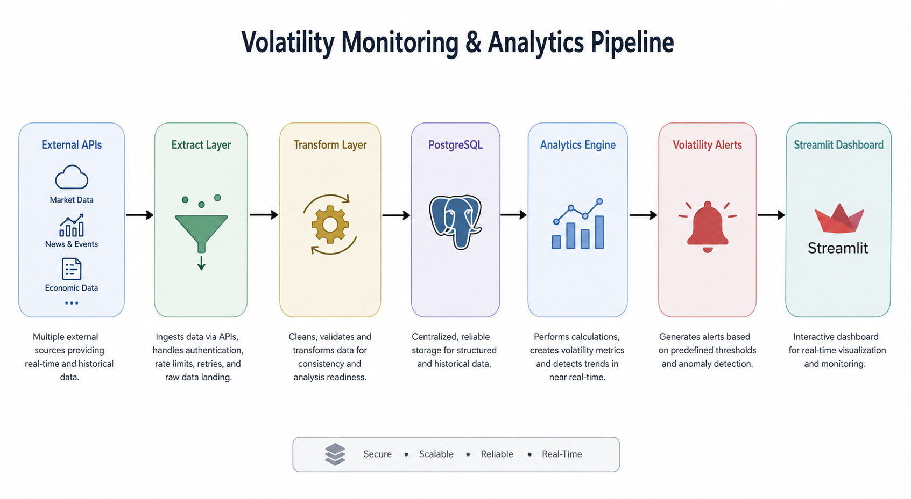
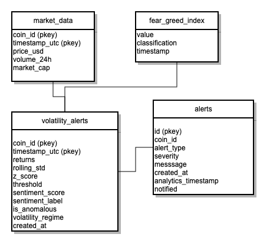
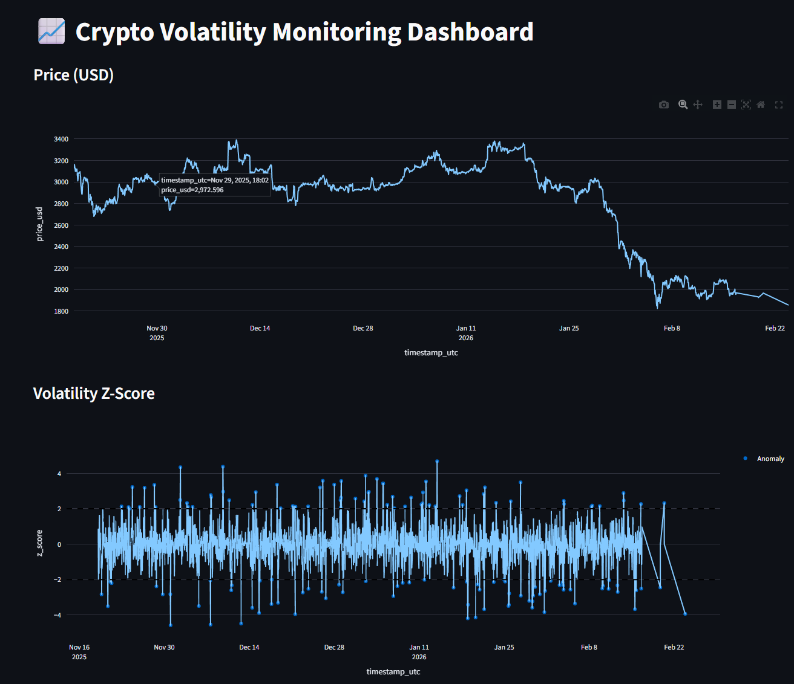

# Crypto Volatility Monitoring Pipeline

## Overview

A fully dockerised data pipeline that ingests cryptocurrency market data, computes rolling volatility indicators, detects abnormal market conditions 
using statistical thresholds adjusted by sentiment data, generates alerts based on sentiment, volatility and regime changes and visualizes results through a live dashboard. 

---
## Business Problem

Cryptocurrency markets are highly volatile and strongly influenced by market sentiment.
Simple price tracking provides limited insight into risk events or abnormal behavior.

This project addresses the following questions:

- Was is price movement statistically abnormal, not just volatile?
- How does market sentiment (Fear & Greed Index) influence volatility risk?
- Can we detect early signals of extreme market conditions?

---

## Architecture


The pipeline:

1. Ingests real-time crypto market data from CoinGecko API (price, volume, market metrics)
2. Ingests sentiment data (Fear & Greed Index)
3. Engineers volatility and return-based features
4. Detects anomalies using rolling statistics
5. Adjusts anomaly thresholds dynamically based on market sentiment
6. Stores both raw data and analytical outputs in PostgreSQL
7. Creates alerts based on key changes in sentiment, regime or volatility
8. Displays analytics through a live dashboard
9. Orchestration handled by Apache Airflow


This allows downstream use cases such as:
- Risk alerts
- Monitoring dashboards
- Quantitative research
- Model training datasets

### Data Model



### Features

- Extraction of multiple coins with **dynamic fetch function**
- Fully **Dockerized, Airflow Orchestration, pipeline PostgreSQL and dashboard** for portability
- Historical backfill (90 days hourly data)
- Incremental ingestion
- Rolling volatility calculation
- Z-score anomaly detection
- Sentiment-aware thresholds
- Persistent analytics store
- Interactive dashboard
- Scheduled execution
- Slack notification alerts

### Data Sources
### Market Data
- CoinGecko API
- Metrics include:
  - coin_id
  - current_price_usd
  - market_cap_usd
  - total_volume_usd 
  - circulating_supply price_change_24h_pct
  - timestamp (UTC)

### Sentiment Data
- Fear & Greed Index API
- Used to:
  - Classify market sentiment
  - Adjust anomaly detection

---

## Analytic Logic
### Volatility Features

For each asset:

- Log or percentage returns
- Rolling standard deviation
- Z-score of returns

### Anomaly Detection

An observation is flagged as anomalous when:

|z_score| > threshold

The threshold is dynamically adjusted:
- Extreme Fear → lower threshold (higher sensitivity)
- Extreme Greed → moderately lower threshold
- Neutral → standard threshold

This reflects real-world risk behavior where sentiment amplifies volatility impact.

---

## Technology Stack
- Python 3.11
- Pandas
- REST APIs (CoinGecko + Fear & Greed Index)
- PostgreSQL (via Docker)  
- Git
- Streamlit + Plotly
- Apache Airflow

---

## Setup Instructions - Manual

### 1. Clone repository
```bash
git clone git@github.com:Jack-McG496/crypto-portfolio.git

cd crypto-market-etl
```
### 2. Create a virtual environment
```bash
python -m venv venv 
venv\Scripts\activate      # Windows
source venv/bin/activate   # Mac/Linux
```
### 3. Run Dockerised Pipeline with Airflow
```bash
docker compose --profile airflow up -d
```
### 3.2. Run Dockerised Pipeline without Airflow
```bash
docker compose up -d postgres backfill pipeline dashboard
```

## Example Dashboard



---

## Extending the Project
- Real-time streaming (Kafka)
- Machine learning anomaly detection
- Backtesting alert effectiveness
- Cloud Deployment